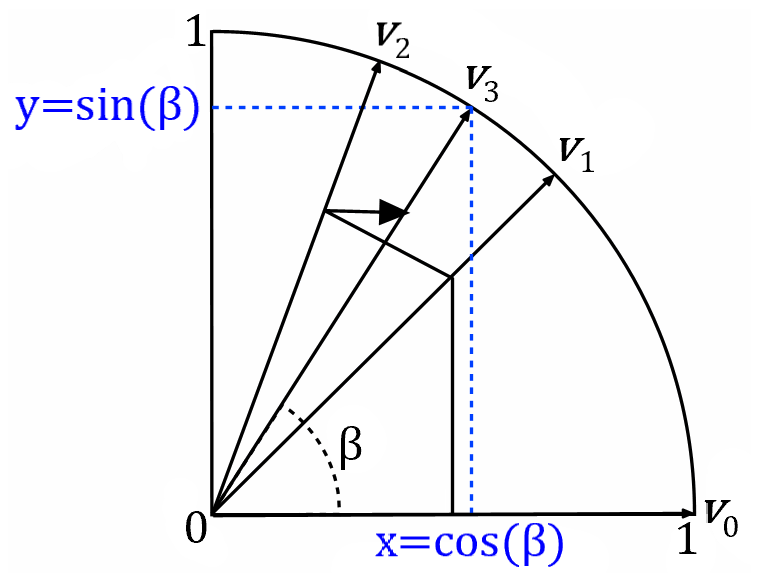

# CORDIC

From [CORDIC- Wikipedia](https://en.wikipedia.org/wiki/CORDIC)

## Rotation Mode

Calculates the sine & cosine of a given input angle and magnitude. This same operation can be used to convert from polar notation (magnitude & phase) to cartesian/rectangular coordinates (X,Y).

## Vectoring Mode

Calculates the phase and magnitude of a given X/Y coordinate pair. This operation can be used to convert from cartesian/rectangular coordinates (X,Y) to polar notation (magnitude & phase). As well, the magnitude/phase of complex (I/Q) signals can be found with this same calculation.

